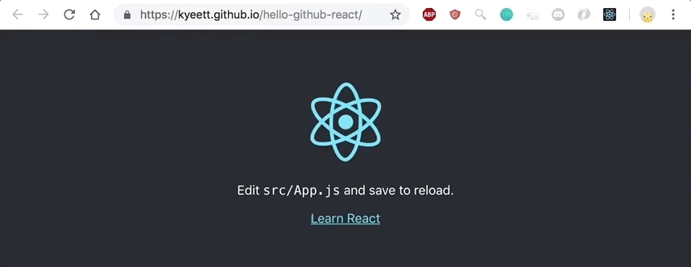

# Create a

This project was bootstrapped with [Create React App](https://github.com/facebook/create-react-app).

## Introduction

This tutorial shows you how to create a simple React app and upload it to [GitHub Pages](https://pages.github.com/). It uses `create-react-app` and `hub`.

You can see it at <https://kyeett.github.io/gh-pages>.

## Tutorial

### Prerequisites

1. `npm` - package managager for javascript libraries
   - <https://www.npmjs.com/get-npm>
2. `create-react-app` - tool to create the boilerplate for a simple React app
   - <https://github.com/facebook/create-react-app>
3. `hub` - tool to simplify creating and managing `git` repositories on `github`
   - <https://github.com/github/hub>

### Get started

1. Create a new React app (1 minute)

   ```bash
   create-react-app hello-github-react
   ```

   - You can name your app anything, except `gh-pages`.

2. Install `gh-pages` javascript packages as a dependency

   ```bash
   cd hello-github-react
   npm install gh-pages --save
   ```

3. Update `package.json` with app specifics

   - Open `package.json` in your favorite editor. I use [v]. It's the root of your React app.
   - Add the `homepage` property to the top level to be `https://{username}.github.io/{repository-name}`.

   ```bash
   "homepage": "https://kyeett.github.io/hello-github-react"
   ```

   - In the exisiting `scripts` property, add `predeploy` and `deploy`:

   ```json
    "scripts": {
        //...More lines here
        "predeploy": "npm run build",
        "deploy": "gh-pages -d build"
    }
   ```

4. Create a new repository on GitHub using `hub`

   ```bash
   hub create
   ```

   - This creates a repository at `https://github.com/{username}/{repository-name}` and configures the local `git repository` to use this as remote.

5. Generate a build and deploy to GitHub Pages

   ```
   npm run
   ```

   - Done! Your page should now be accessible at the url specified in step 3. In my case <https://kyeett.github.io/hello-github-react>. For me it took about a minute until the url was accessible.
     
   - Note: this pushes the generated static pages to `gh-pages` branch in the GitHub repository, not the actual source code

6. (optional) Upload source code to GitHub

   ```bash
   git add package.json # Only thing that has changed
   git commit -m "Add deploy scripts for GitHub pages"
   ```

   - `create-react-app` has already done the initial commit, just add the recent changes.

## References

- [Gitman's tutorial on deploying a React app to GitHub pages](https://github.com/gitname/react-gh-pages)
